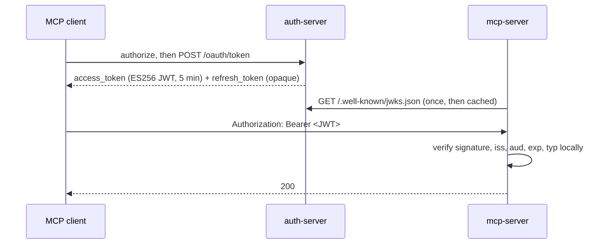

# JWT access tokens (experimental)

**Experimental.** The `accessTokens` option and `createJwtAccessTokenValidator()` may change in a minor release. See [JWT access tokens](../../docs/jwt-access-tokens.md).

The [split workers](../split-workers) example with signed JWT access tokens. The MCP server verifies each token itself instead of calling the authorization server:

- `auth-server/`: `OAuthAuthorizationServer` with `accessTokens`. It signs ES256 access tokens, adds a `plan` claim, and publishes its public keys at `/.well-known/jwks.json`.
- `mcp-server/`: `OAuthResourceServer` with `createJwtAccessTokenValidator()`. It fetches the auth server's public keys over a Service Binding, caches them for five minutes, and checks each token locally.
- `generate-signing-key.mjs`: creates a signing key.

`e2e.test.ts` runs both Workers in workerd and walks a client from registration to an authorized MCP call (`npx vitest run examples/jwt-access-tokens`).



## 1. Create a signing key

```sh
node generate-signing-key.mjs | npx wrangler secret put JWT_SIGNING_KEY -c auth-server/wrangler.jsonc
```

The key is an EC P-256 private JWK with a `kid`. It goes straight into the secret store. Don't write it to a file or commit it.

## 2. Issue JWTs

```ts
const authorizationServer = new OAuthAuthorizationServer<Env>({
  issuer: 'https://auth.example.com',
  resources: ['https://mcp.example.com/mcp'],
  authorizeEndpoint: '/authorize',
  tokenEndpoint: '/oauth/token',
  accessTokenTTL: 5 * 60,
  accessTokens: {
    issuing: 'jwt',
    jwt: {
      keys: (env) => ({ current: JSON.parse(env.JWT_SIGNING_KEY) }),
      claims: ({ props }) => ({ plan: props.plan }),
    },
  },
});
```

Switching a deployment that already issues opaque tokens? Configure `jwt` while still issuing `'opaque'`, so resource servers load the keys before any JWT exists, then issue `'jwt'`. Earlier opaque tokens keep working until they expire. See [switching from opaque tokens](../../docs/jwt-access-tokens.md#switching-from-opaque-tokens).

The token endpoint now returns a JWT like this one:

```json
{ "alg": "ES256", "typ": "at+jwt", "kid": "2026-09-24" }
{
  "iss": "https://auth.example.com",
  "sub": "user-123",
  "aud": "https://mcp.example.com/mcp",
  "client_id": "…",
  "scope": "mcp:read",
  "iat": 1790000000,
  "exp": 1790000300,
  "jti": "…",
  "grant_id": "…",
  "plan": "pro"
}
```

- **Only the access token changes.** Authorization codes and refresh tokens stay opaque.
- **Claims are readable.** The token is signed, not encrypted, so the client can read every claim. `claims()` decides what goes in. `props` stay encrypted with the grant and are never copied into the token by default.
- **No overriding.** `claims()` can't set the claims the provider owns (`iss`, `sub`, `aud`, `exp`, `iat`, `nbf`, `jti`, `client_id`, `scope`, `grant_id`).
- **Signing failures are safe.** If signing or `claims()` fails, the token endpoint returns `server_error`. The authorization code or refresh token is still usable, so the client can retry.

## 3. Verify JWTs in a resource server

```ts
export default new OAuthResourceServer<Env, AuthProps>({
  resourceMetadata: {
    resource: 'https://mcp.example.com/mcp',
    authorization_servers: ['https://auth.example.com'],
  },
  validateToken: createJwtAccessTokenValidator<Env, AuthProps>({
    issuer: 'https://auth.example.com',
    keys: authServerKeys, // (env) => JwtKey[]: where the public keys come from is yours
    mapClaims: (claims) => (claims.plan ? { userId: claims.sub, plan: claims.plan } : null),
  }),
  handler: {
    fetch(request, env, ctx) {
      return Response.json({ userId: ctx.props.userId, plan: ctx.props.plan });
    },
  },
});
```

`issuer` is the exact `iss` the validator accepts. `keys` returns the auth server's public keys, the `keys` array of its JWKS. The library doesn't fetch anything. [`mcp-server/index.ts`](mcp-server/index.ts) fetches `/.well-known/jwks.json` over its Service Binding and caches it for five minutes. A resource server outside Workers can fetch the same URL over the internet. One that wants no fetch at all can read the keys from its configuration, at the cost of updating that configuration on every rotation.

The validator uses [`jose`](https://github.com/panva/jose) to check the signature, `typ: at+jwt`, `alg: ES256`, `iss`, `aud` (this resource), `exp` and the required claims. `mapClaims` is optional. It builds `ctx.props` from the verified claims, or returns `null` to reject the token. Check the shape of any claim you added before trusting it. Without `mapClaims`, `ctx.props` is `undefined`, and the verified subject, client and scopes are on `ctx.auth`.

## Choosing how resource servers validate

|                          | `authorizationServer.validateToken()` over a Service Binding | `createJwtAccessTokenValidator()` |
| ------------------------ | ------------------------------------------------------------ | --------------------------------- |
| Call per request         | Yes, to the auth server and its KV                           | No                                |
| Sees revocation          | Immediately                                                  | When the token expires            |
| `ctx.props`              | Decrypted grant props                                        | Mapped from token claims          |
| Works outside Cloudflare | No                                                           | Yes                               |

Both accept the same JWTs, so you can use one for some resources and the other for the rest. With offline validation, keep `accessTokenTTL` short: revoking a grant stops refreshes at once, and outstanding access tokens expire within minutes.

## Rotating keys

`keys()` runs per request, so rotation is a change to your secrets, not a deploy. Rotate at least every 90 days:

1. Generate the next key. Add its public half to `JWT_ADDITIONAL_KEYS` and wait for resource servers to pick it up (5 minutes with the example's cache).
2. Make the new key `JWT_SIGNING_KEY` and move the old key's public half into `JWT_ADDITIONAL_KEYS`.
3. Once the old key's last token has expired (`accessTokenTTL`), remove it.

```ts
keys: (env) => ({
  current: JSON.parse(env.JWT_SIGNING_KEY),
  additional: env.JWT_ADDITIONAL_KEYS ? JSON.parse(env.JWT_ADDITIONAL_KEYS) : [],
}),
```

## Deploying your own

Create a KV namespace and put its id in `auth-server/wrangler.jsonc`. Replace the `example.com` hostnames and delete the `alias` lines. Then `npm install @cloudflare/workers-oauth-provider`, set `JWT_SIGNING_KEY` as above, and `npx wrangler deploy` in each directory, auth-server first.
